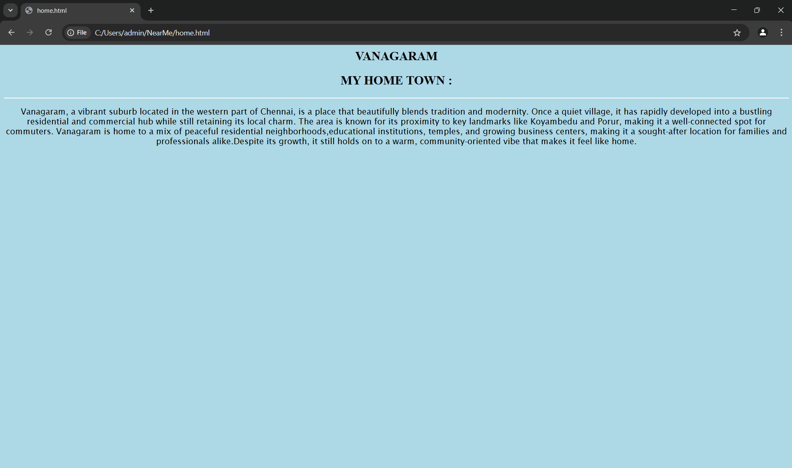
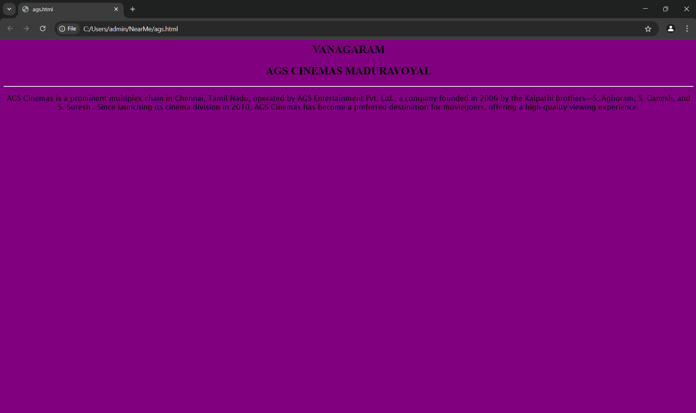
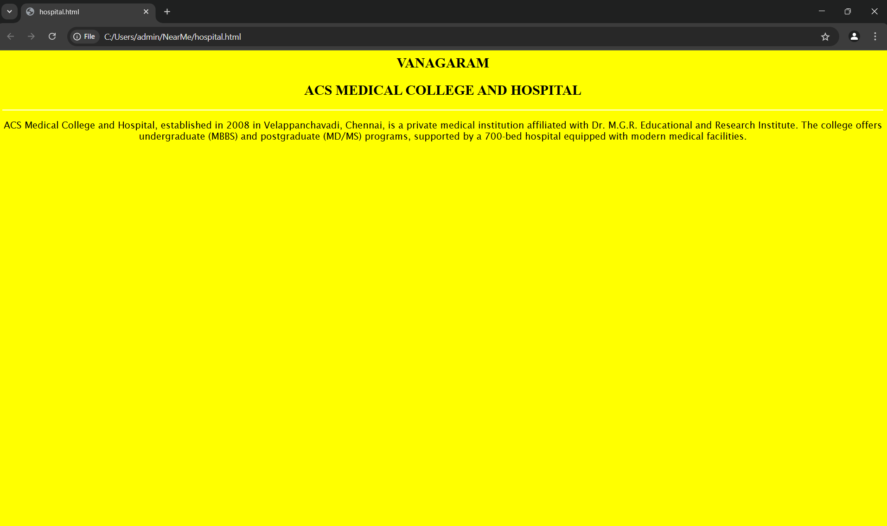
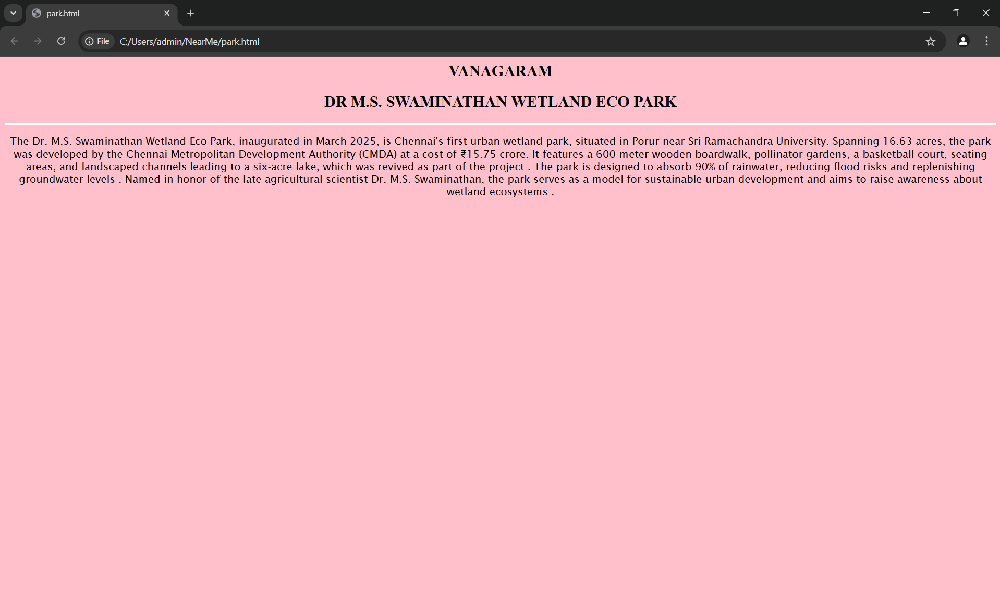
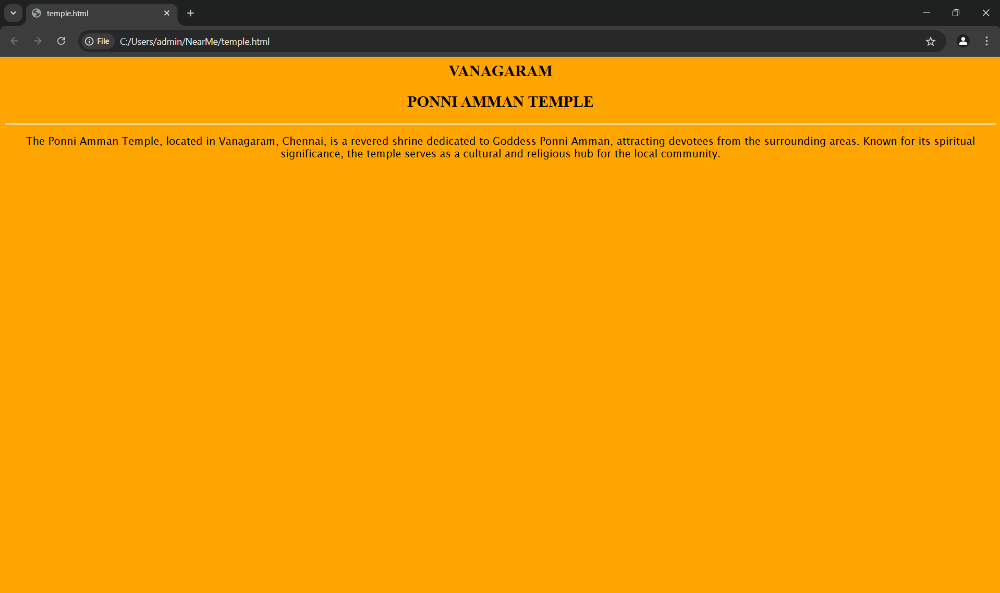

# Ex04 Places Around Me
## Date: 22-04-2025

## AIM
To develop a website to display details about the places around my house.

## DESIGN STEPS

### STEP 1
Create a Django admin interface.

### STEP 2
Download your city map from Google.

### STEP 3
Using ```<map>``` tag name the map.

### STEP 4
Create clickable regions in the image using ```<area>``` tag.

### STEP 5
Write HTML programs for all the regions identified.

### STEP 6
Execute the programs and publish them.

## CODE
```
map.html

<html>
    <head>
        <title>My City</title>
    </head>
    <body>
        <h1 align="center">
        <font color="red"><b>Vanagaram</b></font>
        </h1>
        <h3 align ="center">
            <font color ="black"><b>S.Dhamini (212224040064)</b></font>

        </h3>
        <center>
            
            <map name="mycity">
            <area shape ="rect" coords="1700,250,850,500" href ="home.html" title ="my home town">
            <area shape ="rect" coords="700,250,850,500" href ="hall.html" title ="m weddings and conventions">
            <area shape ="rect" coords="500,250,100,150" href ="toll.html" title ="porur toll plaza">
            <area shape ="rect" coords="1700,250,1850,500" href ="park.html" title ="swaminada wetland ecopark">
            <area shape ="rect" coords="700,250,850,500" href ="garden.html" title ="porur garden"


            </map>
        </center>
    </body>
</html>

home.html

<html>
    <head >
        <center>
            <h2  allign="center">VANAGARAM </h2>
        </center>
        <center>
            <h2 >MY HOME TOWN :</h2>
            <hr color="white">
        </center>
    </head>
    <body bgcolor="lightblue">
        <center>
        <p style="font-family: 'Lucida Sans', 'Lucida Sans Regular', 'Lucida Grande', 'Lucida Sans Unicode', Geneva, Verdana, sans-serif;" >
            Vanagaram, a vibrant suburb located in the western part of Chennai, is a place that beautifully blends tradition and modernity. 
            Once a quiet village, it has rapidly developed into a bustling residential and commercial hub while still retaining its local charm.
            The area is known for its proximity to key landmarks like Koyambedu and Porur, making it a well-connected spot for commuters.
            Vanagaram is home to a mix of peaceful residential neighborhoods,educational institutions, temples, and growing business centers, 
            making it a sought-after location for families and professionals alike.Despite its growth, it still holds on to a warm, community-oriented vibe that makes it feel like home.
        </p>
    </center>

    </body>
</html>

ags.html

<html>
    <head >
        <center>
            <h2  allign="center">VANAGARAM </h2>
        </center>
        <center>
            <h2 >AGS CINEMAS MADURAVOYAL </h2>
            <hr color="white">
        </center>
    </head>
    <body bgcolor="purple">
        <center>
        <p style="font-family: 'Lucida Sans', 'Lucida Sans Regular', 'Lucida Grande', 'Lucida Sans Unicode', Geneva, Verdana, sans-serif;" >
            AGS Cinemas is a prominent multiplex chain in Chennai, Tamil Nadu, operated by AGS Entertainment Pvt. Ltd.,
             a company founded in 2006 by the Kalpathi brothers—S. Aghoram, S. Ganesh, and S. Suresh . Since launching 
             its cinema division in 2010, AGS Cinemas has become a preferred destination for moviegoers, offering a high-quality 
             viewing experience.
        </p>
    </center>

    </body>
</html>

hospital.html

<html>
    <head >
        <center>
            <h2  allign="center">VANAGARAM</h2>
        </center>
        <center>
            <h2 >ACS MEDICAL COLLEGE AND HOSPITAL</h2>
            <hr color="white">
        </center>
    </head>
    <body bgcolor="yellow">
        <center>
        <p style="font-family: 'Lucida Sans', 'Lucida Sans Regular', 'Lucida Grande', 'Lucida Sans Unicode', Geneva, Verdana, sans-serif;" >
            ACS Medical College and Hospital, established in 2008 in Velappanchavadi, Chennai, is a private medical institution 
            affiliated with Dr. M.G.R. Educational and Research Institute. The college offers undergraduate (MBBS) and postgraduate
             (MD/MS) programs, supported by a 700-bed hospital equipped with modern medical facilities.​


        </p>
    </center>

    </body>
</html>

park.html

<html>
    <head >
        <center>
            <h2  allign="center">VANAGARAM</h2>
        </center>
        <center>
            <h2 >DR M.S. SWAMINATHAN WETLAND ECO PARK</h2>
            <hr color="white">
        </center>
    </head>
    <body bgcolor="pink">
        <center>
        <p style="font-family: 'Lucida Sans', 'Lucida Sans Regular', 'Lucida Grande', 'Lucida Sans Unicode', Geneva, Verdana, sans-serif;" >
            ​The Dr. M.S. Swaminathan Wetland Eco Park, inaugurated in March 2025, is Chennai's first urban wetland park,
             situated in Porur near Sri Ramachandra University. Spanning 16.63 acres, the park was developed by the Chennai 
             Metropolitan Development Authority (CMDA) at a cost of ₹15.75 crore. It features a 600-meter wooden boardwalk, 
             pollinator gardens, a basketball court, seating areas, and landscaped channels leading to a six-acre lake, which
              was revived as part of the project . The park is designed to absorb 90% of rainwater, reducing flood risks and 
              replenishing groundwater levels . Named in honor of the late agricultural scientist Dr. M.S. Swaminathan, the 
              park serves as a model for sustainable urban development and aims to raise awareness about wetland ecosystems .​


        </p>
    </center>

    </body>
</html>

temple.html

<html>
    <head >
        <center>
            <h2  allign="center">VANAGARAM</h2>
        </center>
        <center>
            <h2 >PONNI AMMAN TEMPLE</h2>
            <hr color="white">
        </center>
    </head>
    <body bgcolor="orange">
        <center>
        <p style="font-family: 'Lucida Sans', 'Lucida Sans Regular', 'Lucida Grande', 'Lucida Sans Unicode', Geneva, Verdana, sans-serif;" >
            The Ponni Amman Temple, located in Vanagaram, Chennai, is a revered shrine dedicated to Goddess Ponni Amman,
             attracting devotees from the surrounding areas. Known for its spiritual significance, the temple serves as 
             a cultural and religious hub for the local community.


        </p>
    </center>

    </body>
</html>
```
## OUTPUT







## RESULT
The program for implementing image maps using HTML is executed successfully.
